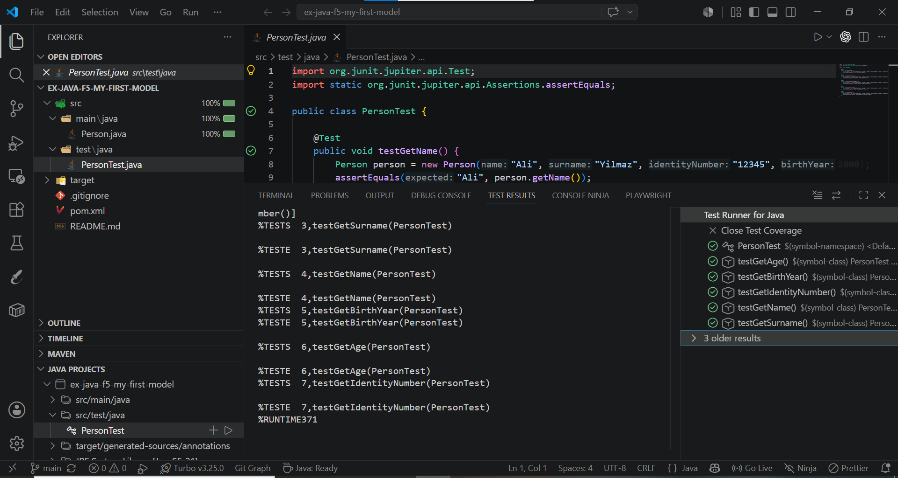

# Person - Java Class Model

A simple Java project that models the concept of a `Person`, including their name, surname, identity number, birth year, and age (calculated dynamically from the birth year).

## Description

This project defines a `Person` class with the following attributes:

- `name` (String)
- `surname` (String)
- `identityNumber` (String)
- `birthYear` (int)
- `age` — not stored directly, calculated via the `getAge(int currentYear)` method

The class includes a constructor that initializes all attributes, and getter methods to access each field.

## Class Diagram

## Project Structure

ex-java-f5-my-first-model/
├── src/
│   ├── main/java/
│   │   └── Person.java
│   └── test/java/
│       └── PersonTest.java
├── assets/
│   ├── class-diagram.png
│   └── coverage.png
├── pom.xml
└── README.md

## Technologies

- Java 21
- Maven
- JUnit 5

## Testing

Unit tests were written using JUnit 5, covering the constructor and all getter/calculation methods of the `Person` class.

**Test coverage: 100%**

## How to Run the Tests

mvn test

## Author

Raana